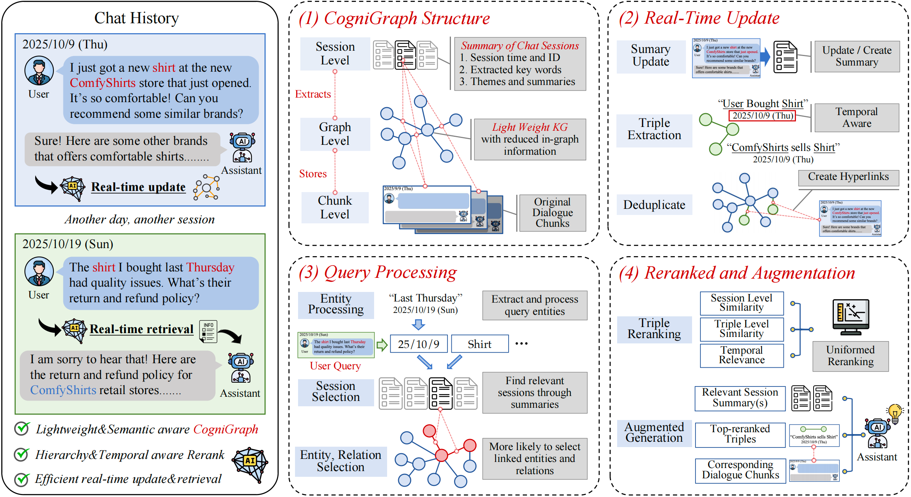
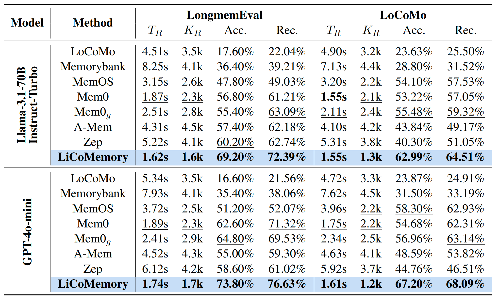
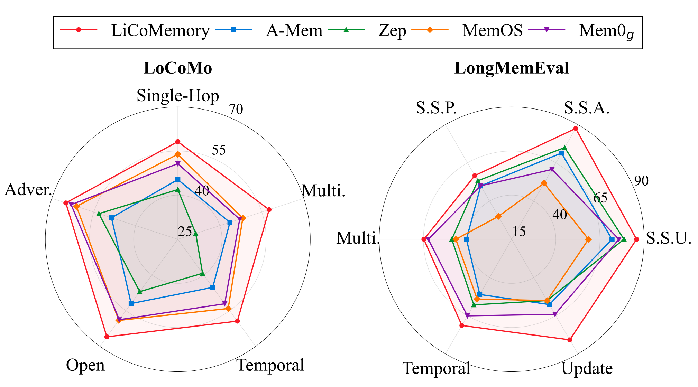

<h1 align="center"> 💫 LiCoMemory: Lightweight and Cognitive Agentic Memory for Efficient Long-Term Reasoning </h1>
<h5 align="center"> If you like our project, please give us a star ⭐ on GitHub for the latest update.</h5>

<h5 align="center">



</h5>

LiCoMemory is a novel end-to-end agentic memory framework that supports real-time updating
and retrieval, enabling efficient and scalable retrieval over multi-session dialogues. LiCoMemory introduces Cognigraph, a lightweight hierarchical graph that utilizes entities and relations as semantic indexing layers, and employs temporal and hierarchy-aware search with integrated reranking for adaptive and coherent knowledge retrieval.

## 💫 Key Features

- **Multi-Session Memory**: Efficiently stores and retrieves information across multiple dialogue sessions, enabling long-term conversation memory.
- **Dynamic Graph Construction**: Supports real-time graph update and retrieval augmentation during human-agent interaction.
- **Hierarchical Cognigraph**: Maintains a multi-layered yet lightweight graph structure for efficient update and accurate retrieval.
- **Time-Aware Retrieval**: Leverages a unified rerank to achieve balance between entity-level, session-level and temporal-level similarity.

## 🚀 Get Started

Requirements.txt is included to help get you started. To run LiCoMemory, use the following command:

```bash
python main.py -opt config/Memory.yaml -dataset_name <dataset_name> -root <root_name> -query 1
```

### Parameters

- `-opt`: Path to the configuration YAML file (e.g., `config/Memory.yaml`)
- `-dataset_name`: Name of the dataset (e.g., `locomo_0`, `longmem_ku/lm_1`)
- `-external_graph`: (Optional) Path to external graph file to load from
- `-root`: (Optional) Root directory name for storing results
- `-query`: (Optional) Whether to run query and evaluation (`1` to enable, `0` to disable). If not specified, will prompt user

### Configuration

Update `config/Memory.yaml` to configure:

1. **Dataset Path**: Set `data_root` to your dataset directory
2. **API Keys**: Configure your LLM and embedding API keys
3. **Key Parameters**:
   - `force`: Set True for compulsary graph reconstruction; Set False for loading existing graph structure from given path
   - `enable_visual`: Set True for a visual feedback of the retrieved content
   - `enable_CogniRank`: Set True to enable the unified rerank
   - `enable_llm_eval`: Set True to utilize LLM judging for the answer; Set False to enable the exact match evaluation
   - `enable_summary`: Set True to activate session summary generation

## 🧰 Experimental Settings

We have incorporated several baseline methods:

| Baseline |Paper| Code |
| -------- |-| ---- |
| LoCoMo       |[Evaluating Very Long-Term Conversational Memory of LLM Agents](https://arxiv.org/abs/2402.17753) | [LoCoMo](https://github.com/snap-research/locomo) |
| A-Mem       |[A-MEM: Agentic Memory for LLM Agents](https://arxiv.org/abs/2502.12110) | [A-Mem](https://github.com/agiresearch/A-mem) |
| Mem0       |[Mem0: Building Production-Ready AI Agents with Scalable Long-Term Memory](https://arxiv.org/abs/2504.19413)| [Mem0](https://github.com/mem0ai/mem0)    |
| Zep       |[Zep: A Temporal Knowledge Graph Architecture for Agent Memory](https://arxiv.org/abs/2501.13956)| [Zep](https://github.com/getzep/zep)    |
| MemOS       |[MemOS: A Memory OS for AI System](https://arxiv.org/abs/2507.03724)| [MemOS](https://github.com/usememos/memos)    |

The following datasets are utilized for testing:

- [**LOCOMO**](https://github.com/snap-research/locomo) focuses on extremely long multi-session dialogues, containing 1,986 questions in five distinct categories: single-hop, multi-hop, temporal, open-domain and adversial reasoning.
- [**LongmemEval**](https://github.com/xiaowu0162/LongMemEval) is a comprehensive benchmark for evaluating long-term memory in conversational agents, consists of 500 questions across six types: single-session user (S.S.U.), single-session assistant (S.S.A.), single-session preference (S.S.P.), multi-session, temporal reasoning, and knowledge update.

Use the scirpts in the folder 'dataset' to modify the original dataset into the intended format for LiCoMemory.

## ⚙️ Experimental Results

LiCoMemory achieves state-of-the-art QA accuracy and recall with lower latency, retrieval volume and token consumption than competing memory frameworks on two long-term dialogue benchmarks across different backbone models, verifying the advantages of its CogniGraph structure and precise retrieval design.



Subset breakdowns also confirm LiCoMemory's consistent superiority across all task types, with the largest improvements in temporal-reasoning and multi-session related queries.



<!-- For more detailed experimental results, check out our paper [here](https://arxiv.org/abs/2511.01448)! -->

<!-- ## 📝 Citation

If you use this code in your research, please cite:

```bibtex
@article{huang2025licomemory,
  title={LiCoMemory: Lightweight and Cognitive Agentic Memory for Efficient Long-Term Reasoning},
  author={Huang, Zhengjun and Tian, Zhoujin and Guo, Qintian and Zhang, Fangyuan and Zhou, Yingli and Jiang, Di and Zhou, Xiaofang},
  journal={arXiv preprint arXiv:2511.01448},
  year={2025}
}
```

## Acknowledgements

We acknowledge these excellent works for providing open-source code and inspiration: [Zep](https://github.com/getzep/zep), [Mem0](https://github.com/mem0ai/mem0), [A-Mem](https://github.com/agiresearch/A-mem), [LoCoMo](https://github.com/snap-research/locomo), [LongMemEval](https://github.com/xiaowu0162/LongMemEval), [MemOS](https://github.com/usememos/memos). -->
